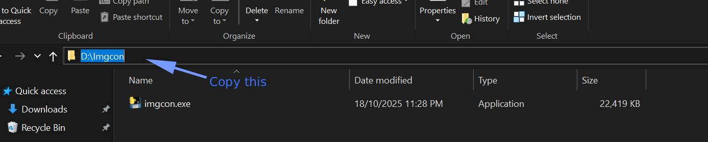
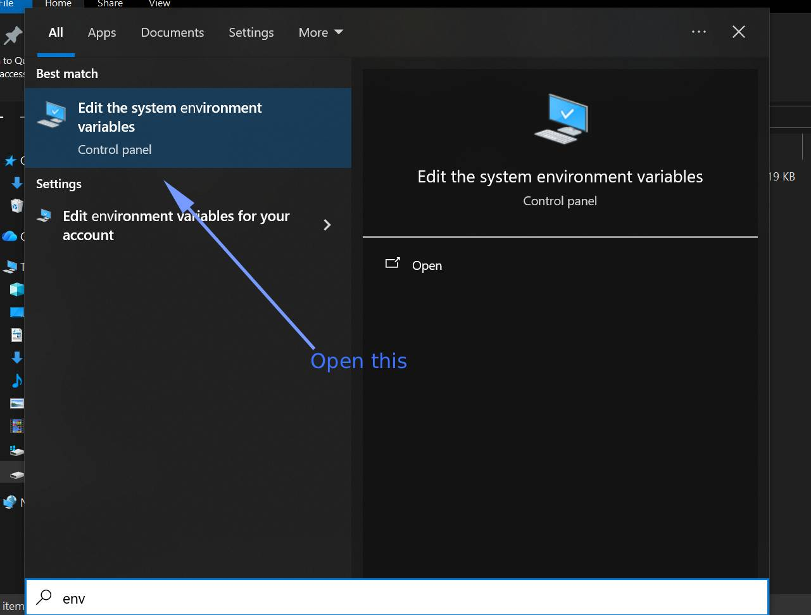
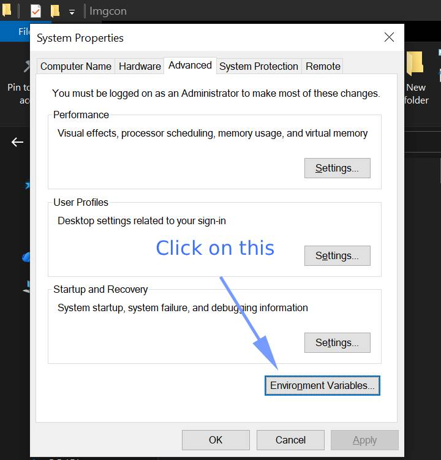
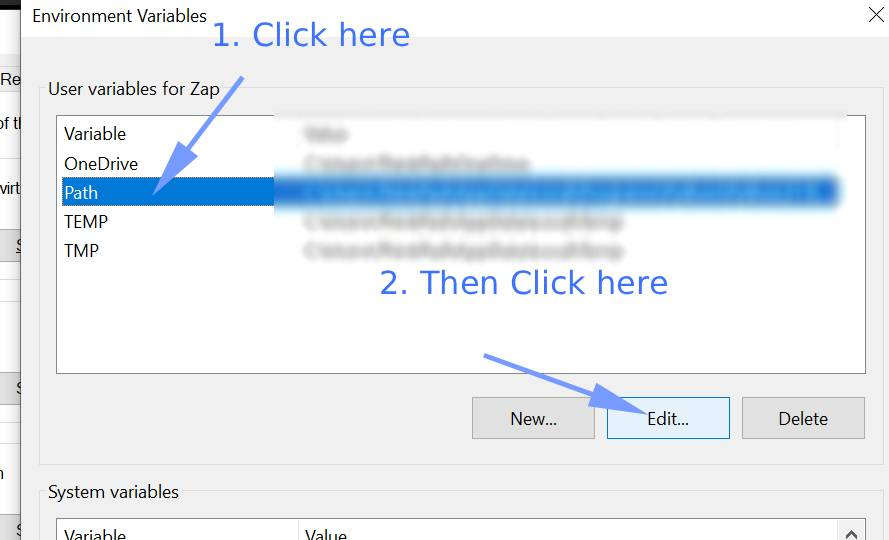
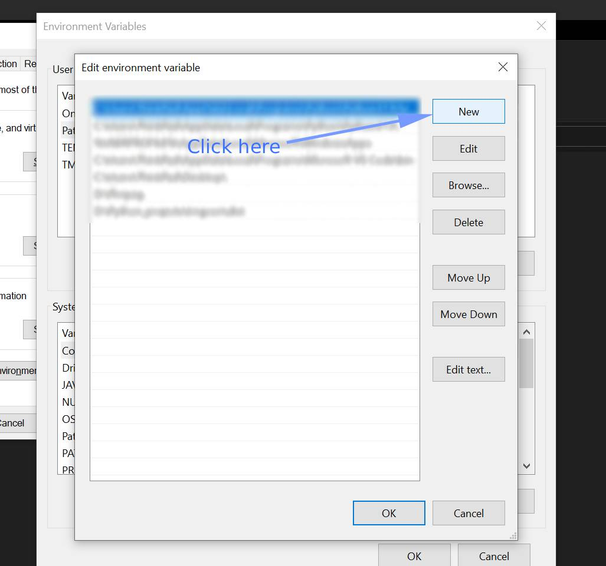
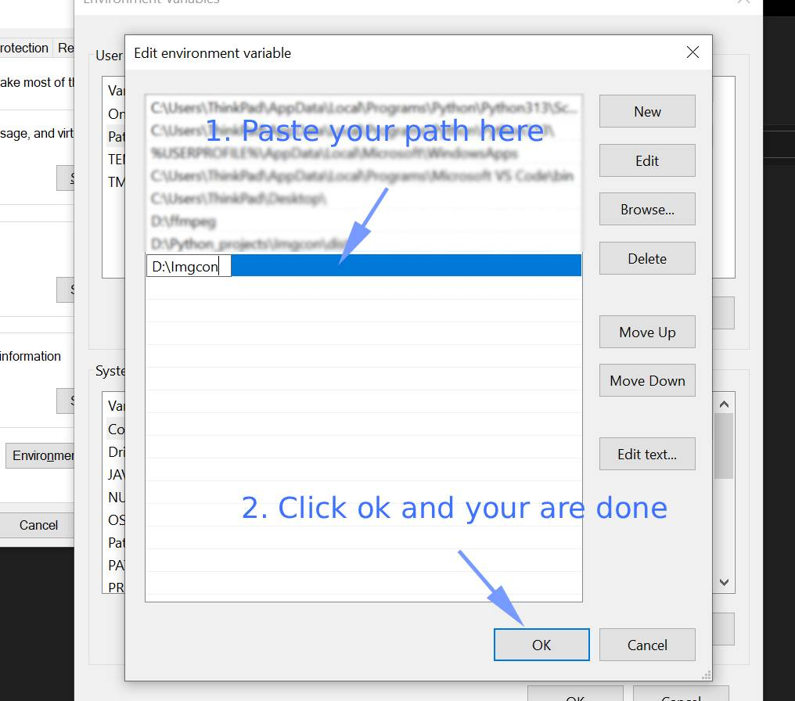

# Imgcon
A Command line image format converter for common file types for windows.

It uses Pillow under the hood.

Currently Supported file types

- png
- jpg/jpeg
- webp

## Navigation

- ### [How to install](#how-to-install-1)
- ### [How to use](#how-to-use-1)
- ### [Demo Video](#demo-video-1)

## How to install

Download imgcon.zip from the [releases](https://github.com/Zap-09/Imgcon/releases) page.

Unzip it where you don't need admin privileges. Put it somewhere like D:/your folder/imgcon.exe

Copy the path where you put the file. Example D:/your folder. And add it to the PATH in your System Environment Variables.

If you don't know how to add to PATH in System Environment Variables

 
Click here

 1. 
  
 2. 
  
 3. 
  
 4. 
  
 5. 
  
 6. 
  

 

## How to use

Open cmd and cd where you have your images. 

### For Single file convertion

`imgcon -i "your file name" -e webp -o "conveted folder"` 

Here  

-i flag takes the path/name of your image file  

-e is the file type you want to convert to  

-o is the output folder. This flag is optional. If you don't use it the converted file will store where the script was run from. You can also pass a folder path it will make those folders if the folders name was valid.

### For batch convertion

`imgcon -d "path to your folder" -e webp -o conveted`

Here  

-d takes a folder path and finds all the image files in that folder(Not sub folder) and converts them.

If you want to inclue subfolders as well use:   

`imgcon -sd "path_to_your_folder" -e webp -o converted`

This will find all the images in that folder and sub folders.

There are more flags for seasific file type that you can file by using  
`imgcon --help` 

## Demo Video 

Click here

<video width="100%" height=auto controls src="Assets/Videos/demo.mp4">
</video>

## Todo
### Stuff I want to add in the future

- Add a filter to include and exclude file type when batch conversion

- Add a settings config. Currently all default values are hardcoded.

- Want to add more file types and functions