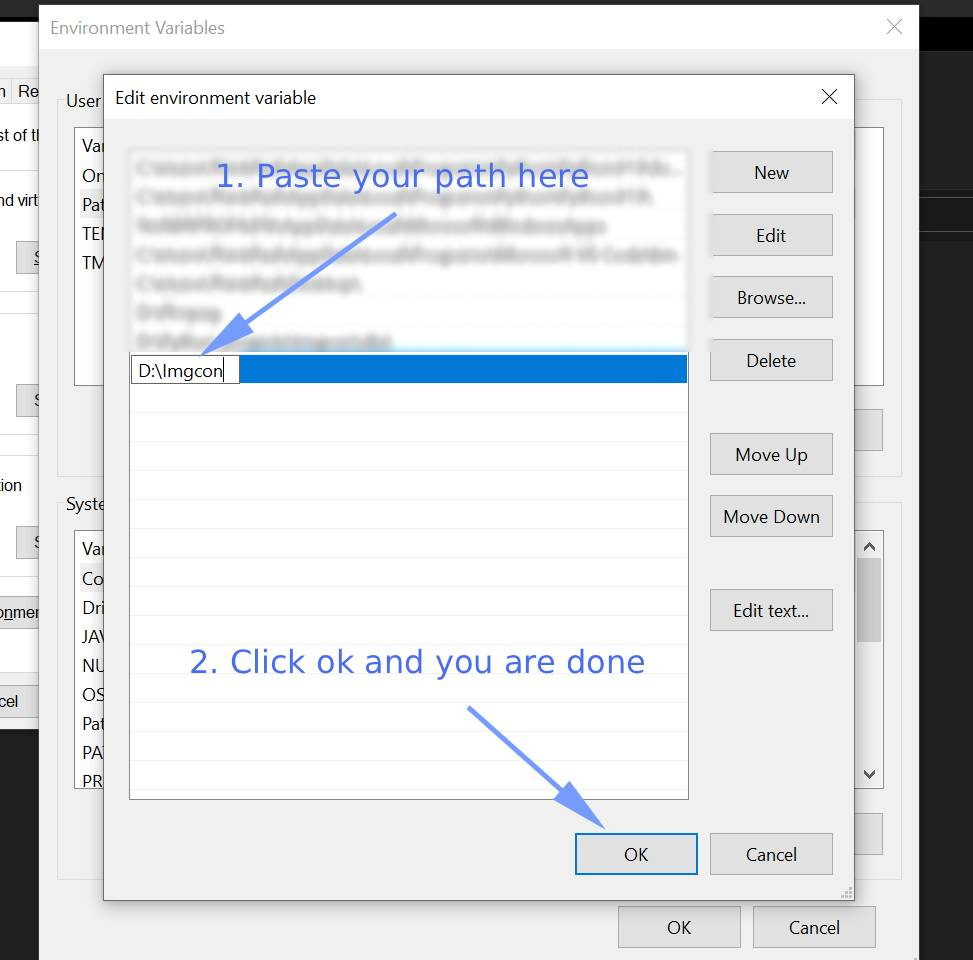

# Imgcon
A Command line image format converter for common file types for windows.

It uses Pillow under the hood.

Currently Supported file types

- png
- jpg/jpeg
- webp

## Navigation

- ### [How to install](#how-to-install-1)
- ### [How to use](#how-to-use-1)

## How to install

Download imgcon.zip from the [releases](https://github.com/Zap-09/Imgcon/releases) page.

Unzip it where you don't need admin privileges. Put it somewhere like D:/your folder/imgcon.exe

Copy the path where you put the file. Example D:/your folder. And add it to the PATH in your System Environment Variables.

If you don't know how to add to PATH in System Environment Variables

 
Click here

 1. 
  
 2. 
  
 3. 
  
 4. 
  
 5. 
  
 6. 
  

 

## How to use

Open command prompt and cd into your folder where you have your images that you want to convert.

Then type

` imgcon -i your_file_name -e png -o converted  `

Imgcon takes 3 arguments 
- -i is for input
- -e is for the extension you want to convert to
- -o is for the output folder (Optional)

Note: If your file has space in the file name you need to surround it with double quotes. Example :  
` imgcon -i "your file name" -e png -o "converted folder" `

-i and -e is required for the exe to run. -i can be a file or a folder. If you enter a folder it will convert all the images in that folder. 
And if you want to convert all the images in the current folder use '/ ' as the -i argument.

-o argument is optional. If you don't pass a folder to it will convert the image where the exe was run from.  Example : 
` imgcon -i "mine_file.png" -e webp `

-o argument folder doesn't need to already exist. As long as the entered folder name is valid, it will make these folder.
